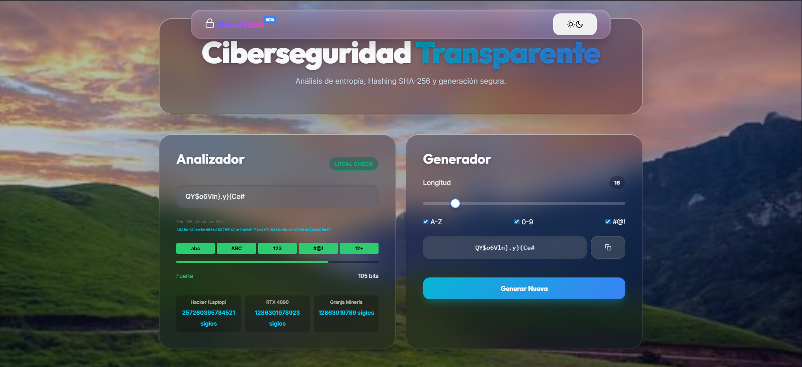

# 🛡️ GlassVault - Security Suite


> Una suite de herramientas de criptografía y seguridad ejecutándose 100% en el navegador. Diseño moderno "Glassmorphism" con lógica de análisis de contraseñas de nivel forense.




## 📋 Descripción

**GlassVault** no es solo un validador de contraseñas. Es una herramienta educativa y funcional que simula cómo los atacantes (Crackers) analizan la seguridad de una credencial. Utiliza la API nativa `Web Crypto` para generar hashes SHA-256 reales y algoritmos matemáticos para calcular la entropía en bits.

Todo el procesamiento se realiza en el **lado del cliente (Client-Side)**. Ningún dato sale de tu navegador.

## ✨ Características Principales

### 🔐 1. Analizador de Contraseñas (Cybersecurity Level)
* **Cálculo de Entropía:** Mide la aleatoriedad real de la contraseña en bits.
* **Visualización SHA-256:** Muestra en tiempo real cómo se ve tu contraseña hasheada en una base de datos.
* **Detección de Patrones:**
    * Detecta "Leet Speak" (ej: `P@ssw0rd` -> `password`).
    * Identifica patrones de teclado físicos (ej: `qwerty`, `asdfgh`).
    * Alerta sobre repeticiones y diccionarios comunes.
* **Estimación de Crackeo:** Calcula tiempos de fuerza bruta basados en hardware real (desde una Laptop hasta una Granja de Minería).

### ⚡ 2. Generador Seguro
* Generación de contraseñas aleatorias usando `window.crypto.getRandomValues` (Criptográficamente seguro, no usa `Math.random`).
* Longitud y caracteres configurables.
* Copia segura al portapapeles.

### 📧 3. Simulador de Email Fantasma
* Herramienta de UI para generar identidades temporales (simulación visual) con temporizadores de expiración.

### 🎨 4. UI/UX
* **Glassmorphism:** Diseño moderno con efectos de desenfoque y transparencias.
* **Spotlight Effect:** Efecto de iluminación interactivo que sigue el mouse.
* **Tema Oscuro/Claro:** Detección automática y toggle manual.

## 🛠️ Tecnologías Usadas

* **HTML5 Semántico**
* **CSS3 Moderno** (Variables CSS, Flexbox, Grid, Backdrop-filter)
* **JavaScript (ES6+)**
    * `crypto.subtle` API
    * `BigInt` para cálculos matemáticos masivos
    * `requestAnimationFrame` para animaciones fluidas

## 🚀 Instalación y Uso

Este proyecto es estático, por lo que no requiere instalación de dependencias ni servidores.

1.  **Clonar el repositorio:**
    ```bash
    git clone [https://github.com/tu-usuario/glassvault.git](https://github.com/tu-usuario/glassvault.git)
    ```
2.  **Abrir el proyecto:**
    Simplemente abre el archivo `index.html` en tu navegador favorito.

## 🧠 ¿Cómo funciona el cálculo de tiempo?

El sistema estima el tiempo de crackeo basándose en la **Entropía (H)** y la tasa de intentos por segundo (**Hash Rate**) de hardware actual (2025):

| Hardware | Hash Rate Aprox. | Escenario |
| :--- | :--- | :--- |
| **Hacker (Laptop)** | 50 MH/s | Ataque casual / Script kiddie |
| **RTX 4090** | 10 GH/s | Ataque dedicado / Gaming PC |
| **Granja de Minería** | 1 TH/s | Ataque organizado / Fuerza bruta masiva |

## 🛡️ Privacidad

La seguridad es la prioridad. Puedes auditar el código en `script.js` para verificar que:
* ❌ No hay bases de datos conectadas.
* ❌ No hay llamadas a APIs externas.
* ❌ No hay cookies de rastreo.
* ✅ Todo sucede en la memoria RAM de tu dispositivo.

## 📄 Licencia

Este proyecto está bajo la Licencia MIT - eres libre de usarlo, modificarlo y aprender de él.

---
<div align="center">
  <sub>Desarrollado con ❤️ y mucho café por [cristian_lucas]</sub>
</div>
